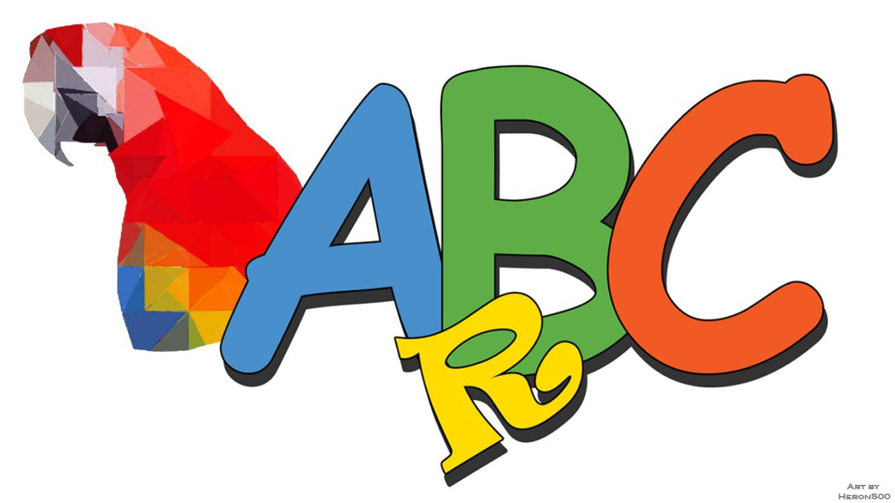
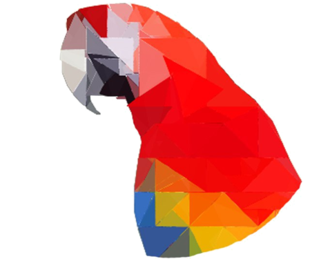

# ArBC

 &emsp;&emsp;  

# Sobre

 &emsp;&emsp; O ArBC tem como finalidade auxiliar na alfabetização de crianças através de uma câmera de celular utilizando aplicação pelo navegador, e apontando a câmera para uma palavra, na tela será mostrado uma imagem correspondente a palavra lida. 

## Porquê do Nome?

- “Ar” vem de um acrônimo para Augmented Reality (AR), realidade aumentada em inglês.
- “ABC” vem como um símbolo para alfabetização.

## O Mascote

 

 &emsp;&emsp; A Arara, por suas belas cores traz um visual lúdico e calmo que agrada pessoas, principalmente crianças. Logo a arara se torna um mascote excelente de um projeto com o objetivo de alfabetização. Também faz a referência do acrônimo AR como o nome da ave.
