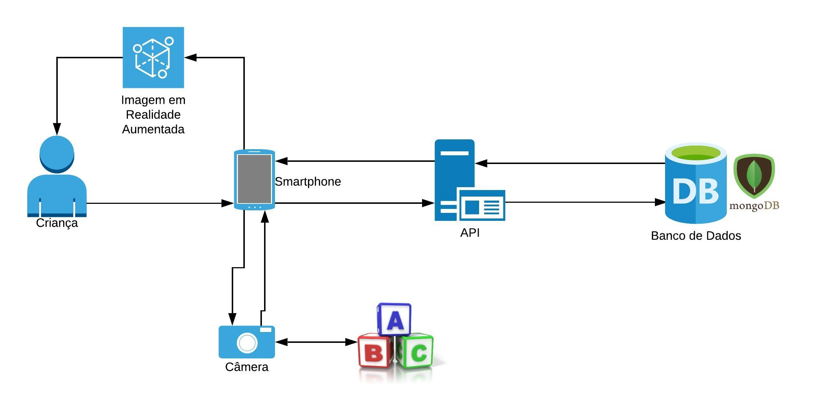
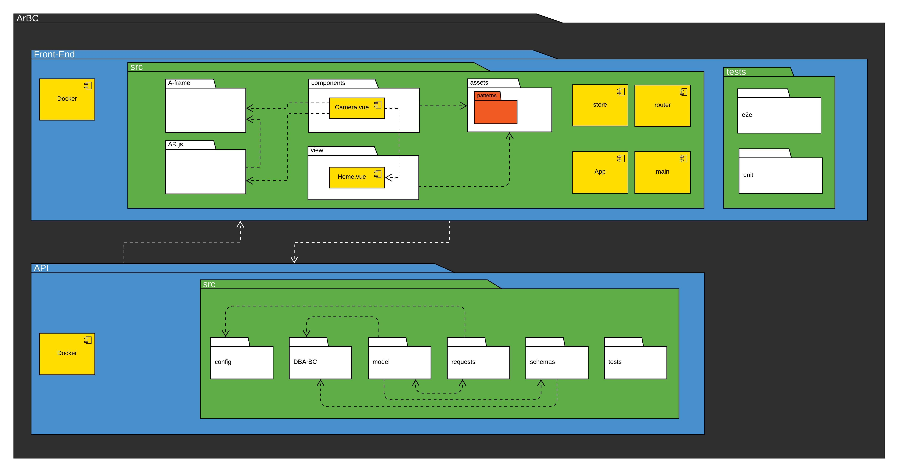

# Histórico de Versões

Data|Versão|Descrição|Autor
-|-|-|-
04/09|1.0.0|Adição do Template do Documento| João Lucas|
07/09|1.1.0|Adição do item 4| Marcelo Victor|
07/09|1.1.1|Melhorias no item 4.1 | Sérgio Cipriano|
07/09|1.2.0|Adição do item 1, 3, 5, 6 e 7| Igor Batista|
07/09|1.3.0|Adição do item 2| Rhuan Carlos|
28/09|1.4.0|Correções links| Sérgio Cipriano|
28/09|1.5.0|Adição do item 2.4| Sérgio Cipriano, Rhuan Carlos, Marcelo Victor|
30/09|1.4.0|Correção link #7 e #6| Sérgio Cipriano|

# Sumário

 1. [Introdução](#1)
  - 1.1 [Finalidade](#1_1)
  - 1.2 [Escopo](#1_2)
  - 1.3 [Definições, Acrônimos e Abreviações](#1_3)
  - 1.4 [Referências](#1_4)
  - 1.5 [Visão Geral](#1_5)
 2. [Representação da Arquitetura](#2)
  - 2.1 [Front-end](#2_1)
  - 2.2 [Back-end](#2_2)
  - 2.3 [Diagrama de relações](#2_3)
  - 2.4 [Diagrama de pacotes](#2_4)
 3. [Metas e Restrições de Arquitetura](#3)
  - 3.1 [Metas](#3_1)
  - 3.2 [Restrições](#3_2)
 4. [Visão dos Casos de Uso](#4)
  - 4.1 [Diagrama de Casos de Uso](#4_1)
  - 4.2 [Atores de Casos de Uso](#4_2)
  - 4.3 [Descrições de Casos de Uso](#4_3)
 5. [Visão Lógica](#5)
 6. [Tamanho e Desempenho](#6)
 7. [Qualidade](#7)

Documento de Arquitetura de Software
------------------------------------

### 1. <a name="1">Introdução</a>

### 1.1 <a name="1_1">Finalidade</a>

 
 &emsp;&emsp; Este documento tem por objetivo estabelecer um posicionamento sobre a aplicação, suas características e seu desenvolvimento em questão. Também expondo as suas funcionalidades e definindo seus requisitos em termos de necessidade para usuários finais.

### 1.2 <a name="1_2">Escopo</a>

 &emsp;&emsp; Este projeto tem como finalidade auxiliar na alfabetização de crianças, esse auxílio será feito através do incentivo causado por meios visuais advindos da tecnologia ,proporcionando um ambiente interativo em um momento tão importante na vida de uma criança.

### 1.3 <a name="1_3">Definições, Acrônimos e Abreviações</a>

|Abreviação|Significado|

|**MDS**| Métodos de Desenvolvimento de Software
|**EPS**| Engenharia de Produto de Software
|**PWA**| *Progressive Web App*

### 1.4 <a name="1_4">Referências</a>

Vuex.vuejs.org . Disponível em: https://vuex.vuejs.org/. Acesso em: 7 set. 2019.

Vuejs.org . Disponível em: https://vuejs.org/. Acesso em: 7 set. 2019.

PAIVA, Igor; PAULINO, João; VICTOR, Marcelo;  QUEIROZ, Rhuan;  CIRRIANO, Sérgio. ArBC: Documento de Visão. Disponível em: https://github.com/fga-eps-mds/2019.2-ArBC/blob/develop/docs/mds/Documento_de_arquitetura.md. Acesso em: 7 set. 2019.

DJORKAEFF, Alexandre; BEZERRA, Davi; DE LYRA, Guilherme; BRANDÃO, Guilherme; REIS, João. Reabilitação Motora: Documento de Visão. Disponível em: https://github.com/fga-eps-mds/2018.1-Reabilitacao-Motora/blob/development/docs/wiki/Documento-de-Arquitetura.md. Acesso em: 7 set. 2019.

### 1.5 <a name="1_5">Visão Geral</a>

 &emsp;&emsp; Este documento é dividido em 7 tópicos descrevendo os detalhes das características do software proposto.
Sendo dividido em:

* Introdução: no qual é introduzido os detalhes gerais sobre a visão do projeto;
* Posicionamento: descrevendo o problema e a oportunidade de negócio;
* Perfis dos Envolvidos e dos Usuários: esta seção descreve o perfil das partes interessadas no projeto;
* Visão Geral do Produto: Esta seção fornece uma visualização de alto nível das capacidades do produto, interfaces para outros aplicativos e configurações dos sistemas;
* Recursos do Produto: breve descrição dos recursos do produto;
* Restrições: as restrições de *design*, restrições externas, como requisitos operacionais ou regulamentares.

## 2. <a name="2">Representação da Arquitetura</a>

### 2.1 <a name="2_1">Front-end</a>

A arquitetura adotada para o front-end é o padrão <i>Vuex</i> que é um <i>state management
 pattern</i>, que consiste em <i>State</i>, <i>View</i> e <i>Actions</i> cada uma com suas respectivas funções:

 |Camada|Função|
 |:--:|:--:|
 |State| A fonte dos dados locais da aplicação.|
 |Mutations| Um mapa do estado atual.|
 |Actions| As diferentes maneiras de mutar o estado em reação ao usuário.

 
O Vue.js adota em sua própria maneira o modelo acima e divide a <i>View</i> se torna os <i> Vue
  Components</i> e além disso insere as <i>Mutations</i> que de forma geral alteram o estado.
 

### 2.2 <a name="2_2">Back-end</a>

A arquitetura adotada para o back-end é o MVT: <i>Model</i>, <i>View</i> e <i>Template </i
>, cada uma com suas respectivas funções:

 |Camada|Função|
 |:--:|:--:|
 |Model| A camada que interage com o bando de dados.
 |View| A camada que interage com o *template* e com a *model*.
 |Template| A camada de renderização da página.

### 2.3 <a name="2_3">Diagrama de Relações</a>

### 2.4 <a name="2_4">Diagrama de Pacotes</a>

## 3. <a name="3">Metas e Restrições de Arquitetura</a>

### 3.1 <a name="3_1">Metas</a>

O sistema deve ter acesso a uma câmera, na qual será lida uma palavra e será mostrada na tela uma imagem, para auxiliar a alfabetização de crianças.

### 3.2 <a name="3_2">Restrições</a>

A aplicação irá ser executada num navegador e a interface gráfica desenvolvida com HTML e CSS, utilizando o Vue.js. A linguagem de programação usada na implementação do <i>front-end</i> é o JavaScript e no <i>back-end</i> é o Python. 

Por ser uma PWA (<i>Progressive Web App</i>) a aplicação poderá ser utilizada em qualquer dispositivo móvel com um navegador e uma câmera.

## 4. <a name="4">Visão dos Casos de Uso</a>

### 4.1 <a name="4_1">Diagrama de Casos de Uso</a>

### 4.2 <a name="4_2">Atores de Casos de Uso</a>

|**Ator**|**Descrição**
:-:|:-:
|**Usuário**|O usuário ao utilizar o software poderá ao apontar o seu aparelho, smartphone ou tablet, para algum tipo de letra ou palavra com significado dentro do idioma PT-BR, e este irá captar a informação e mostrar ao usuário o respectivo GIF correspondente a informação enviada pela câmera.

### 4.3 <a name="4_3">Descrições de Casos de Uso</a>

| Caso de uso | Descrição |
:-:|:-:
| UC01 - Visualizar letra | Mostrar GIF respectivo à letra. |
| UC02 - Visualizar Palavra | Mostrar GIF respectivo à palavra. |

## 5. <a name="5">Visão Lógica</a>

Através de um celular o usuário acessa o aplicativo pelo navegador, seleciona a opção de abrir a câmera e aponta a câmera para uma palavra, na tela será mostrado uma imagem correspondente a palavra lida.

No banco de dados será armazenado palavras e suas respectivas imagens. Ao ler a palavra com a câmera, será feita uma requisição,   e no <i>back-end</i> será procurada a palavra e enviará a imagem correspondente.

## 6. <a name="6">Tamanho e Desempenho</a>

A aplicação roda no navegador, como um aplicativo nativo (PWA - Progressive Web App). Será feita uma identificação da imagem da câmera, o que custa um certo processamento para o aparelho. Com isso concluído será feita uma requisição para o <i>back-end</i> para buscar a imagem. A imagem pode ter tamanhos variados e será baixada do servidor, mas não deve exceder 1MB.

## 7. <a name="7">Qualidade</a>

O aplicativo terá uma interface gráfica simples, apenas disponibilizando acesso à câmera e mostrando a imagem na tela do usuário. O estilo será feito usando HTML e CSS.

